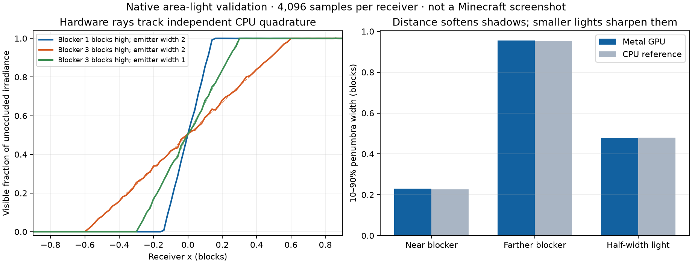

# Finite area lights — native and Java foundation

Historical foundation milestone; subsequent [live frame integration](LOCAL-LIGHT-FRAME-VALIDATION.md) now executes local diffuse lighting in Minecraft. The results below describe the earlier native/bridge stage.

The source renderer now has a Metal area-light irradiance estimator, immutable light publication, a Java 25 FFM interface, and quantitative hardware shadow tests. **Local lights are not yet connected to Minecraft's displayed frames.** The running game retains the preceding attribute-buffer build and its three-sample session preset.

## Lighting model

Each 64-byte light defines a scene-relative center, two orthogonal half-edge vectors, RGB emitted radiance and a one/two-sided flag. Their cross product defines the emitting normal. The native API validates finite values, positive physical area, bounds, reserved fields and a maximum of 1,024 lights. Invalid publications preserve the prior state. Identical publications reuse the allocation and revision; real changes invalidate temporal history without rebuilding geometry. History transfer requires identical light payloads.

`local_irradiance` uniformly selects an emitter and a point on its area, then computes incident irradiance with `N × area × cos(receiver) × cos(emitter) / distance²`. The visibility ray ends just before the sampled emitter, so geometry behind it cannot falsely occlude the light. The geometry factor uses the physical receiver point; only the visibility origin receives the numerical bias. The estimator uses the [area-to-solid-angle transformation and light sampling density](https://pbr-book.org/3ed-2018/Light_Transport_I_Surface_Reflection/Sampling_Light_Sources) and [one/two-sided diffuse area emission](https://pbr-book.org/4ed/Light_Sources/Area_Lights) described in *Physically Based Rendering*.

The shader uses the existing Metal triangle intersector and material-aware visibility, including alpha rejection and the existing dielectric transmission approximation. This returns irradiance before the receiver BRDF. It does not blur a binary shadow or approximate the blocker with a cylinder. The native probe is synchronous and explicitly unsuitable for per-frame rendering; live integration must encode into the renderer's existing command buffer.

## Measured evidence

`rt-core/results/area-light-final.json` and `area-light-shader-final.json` pass Metal API and shader validation. The CPU reference is an independent deterministic 128×128 area quadrature with an analytic half-plane blocker, rather than a copy of the GPU random sampler. Each of 201 receiver points uses 4,096 GPU samples.

| Emitter width | Blocker height above receiver | GPU 10–90% shadow transition | CPU reference |
|---|---:|---:|---:|
| 2 blocks | 1 block | 0.2298 blocks | 0.2264 blocks |
| 2 blocks | 3 blocks | 0.9558 blocks | 0.9534 blocks |
| 1 block | 3 blocks | 0.4784 blocks | 0.4807 blocks |

The emitter height is eight blocks in each comparison. The maximum normalized irradiance error across these profiles is below 0.018. Unoccluded irradiance differs from the independent reference by approximately 0.033%. Doubling the emitter distance from 16 to 32 blocks gives a 3.9847 energy ratio, approaching the expected far-field factor of four for a finite emitter.

This figure plots native test data, not a Minecraft screenshot. The 4,096-sample correctness test is not a real-time performance preset. Uniform selection over many emitters will require better sampling and reconstruction before it is suitable for dense gameplay scenes.

Additional checks pass for one/two-sided emission, summed multiple lights, finite visibility segments, opaque blockers, fully rejected alpha cutouts, dielectric attenuation, empty-light removal, unchanged publication reuse and rejected invalid payloads. `rt-core/results/area-lights-20260914.gputrace` captures the hardware workload with API validation; that earlier capture covers the quantitative geometry tests, with material filtering added in the final separate validation runs.

The packaged Java/native test in `runs/area-light-java-bridge-final.json` verifies the 64-byte light layout, colored irradiance, error propagation, removal, unchanged publication and history identity checks. Existing frame, transport, chunk, attribute-lifetime, temporal, transmission and MetalFX regressions pass (`rt-core/results/area-light-regression-suite.json`).

## Integration still required

1. Encode primary local irradiance into a distinct direct-light target with its own controls and temporal history. Turning GI off must not remove direct local illumination.
2. Supply scene-relative emitters from Minecraft light blocks, including physical shape, color/radiance calibration, off-screen retention, section edits and origin rebasing. Explicitly handle partial models and light-emitting entities.
3. Include local-lit surfaces in reflected/refracted and diffuse paths. Avoid double-counting emissive geometry when combining explicit light samples with BSDF paths; define sampling weights before combining estimators.
4. Retain immutable light allocations until each asynchronous frame completes, and invalidate history on light changes. The current synchronous probe only proves ownership through its completed call.
5. Validate moving blockers, source/receiver distances and off-screen emitters in the copied Minecraft world. Capture matched game views, then profile practical sample counts, memory, streaming and the sustained session.

The full rendering objective remains active. This native/bridge milestone does not establish gameplay support or final performance acceptance.
