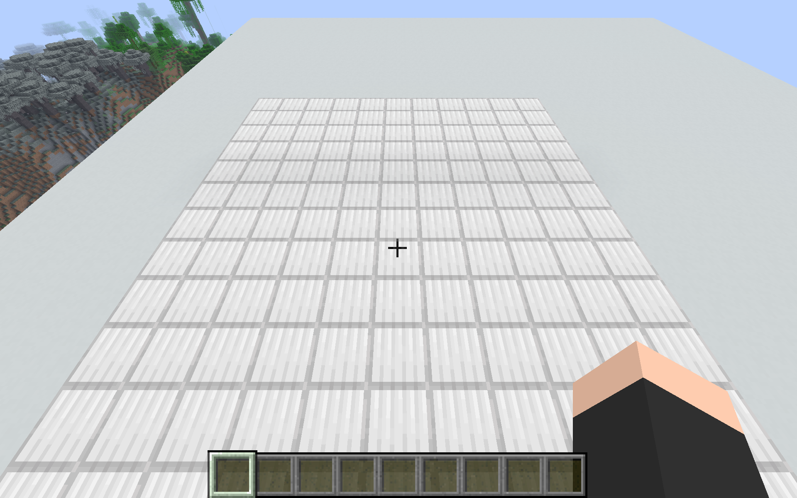
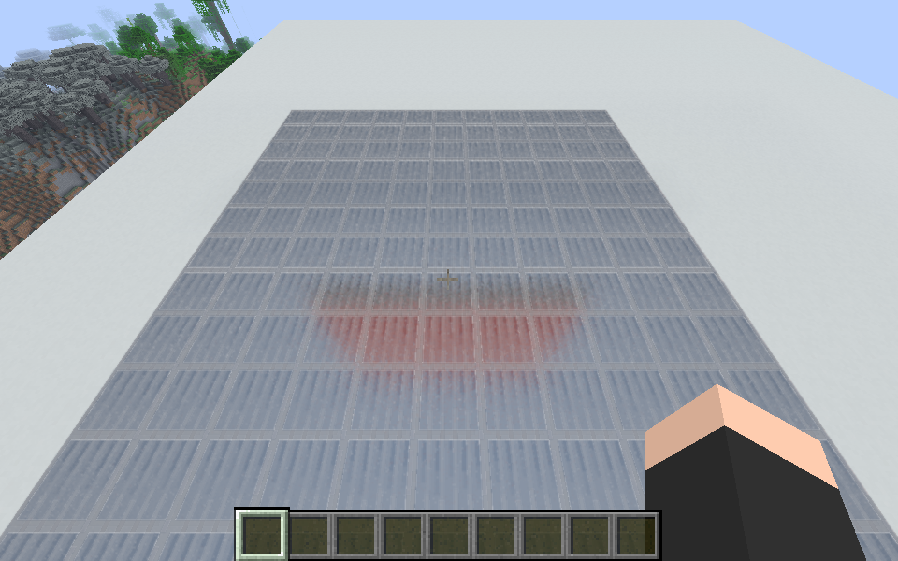
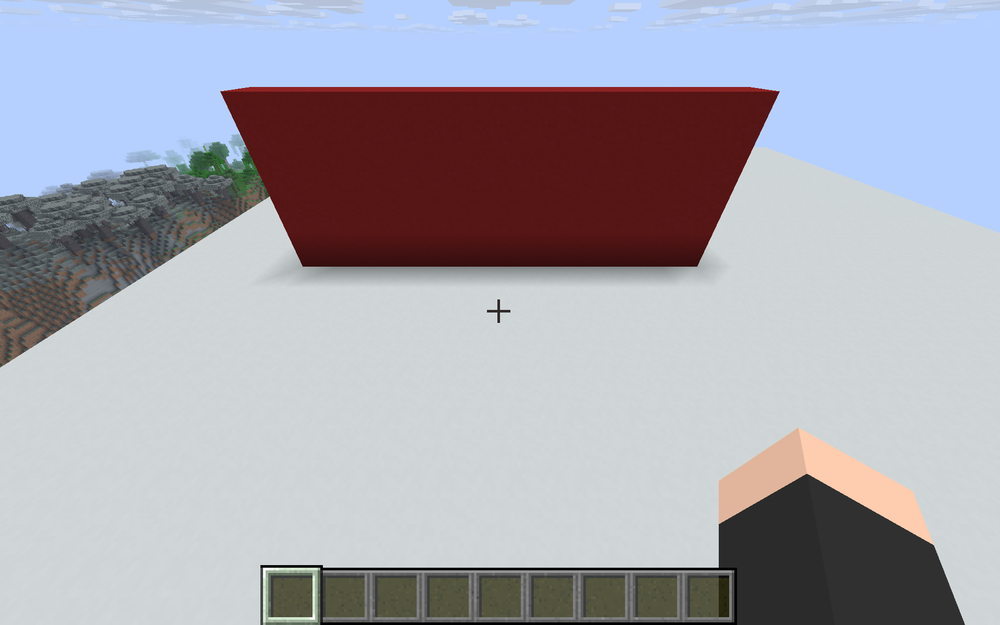
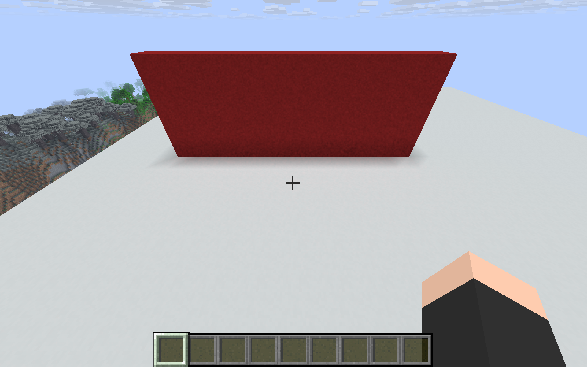

# Material-aware hardware reflections and one-bounce GI

**Historical material milestone.** The [subsequent temporal stage](TEMPORAL-VALIDATION.md) adds history reconstruction and a multi-bounce quality tier; its findings supersede corresponding unimplemented items below.

This development stage adds real texture sampling, roughness-aware reflections, and one diffuse bounce to the existing live Metal visibility pass. The screenshots below are actual Minecraft captures, not generated images. The original Prisma installation and the tuned Prisma instance remain separate.

## Implemented path

`BlockSceneSnapshot` copies solid and cutout block-model triangles on the client thread. `SceneMaterials` copies sprite texels as ARGB8, preserves per-triangle UVs, applies the current block/biome tint, and supplies surface roughness, metallic fraction, emission, transmission classification and IOR. Each native triangle material occupies 96 bytes. Sprite pixels are deduplicated within a snapshot and capped at 16 million texels. The immutable payload crosses to the existing background scene builder.

The CPU image accessor is a normal versioned Fabric Mixin. Minecraft 26.2's `SpriteContents.getUniqueFrames()` returns `[1]` for static sprites; this is not a valid image offset. The first game run caught this and retained raster rendering. The corrected extractor uses frame zero for static images and bounds-checks animated frames. [Rejected-run log](runs/rejected-material-frame-index.log), [exact-version bytecode](runs/sprite-contents-bytecode.txt). Animated sprites currently use their first listed animation frame, not a synchronized live animation.

The Metal shader uses triangle barycentrics to sample the copied texels and converts texture color to linear RGB. Closest hardware intersections skip alpha-tested texels below the cutoff. This prototype allows at most 32 successive alpha rejections per ray. Translucent blocks and fluid/entity meshes remain excluded from the live scene; glass classification is not completed glass rendering.

Reflections sample a GGX distribution using the surface roughness, Schlick Fresnel and Smith masking. A secondary hit uses its actual texture color, emission and sun visibility. Misses use an explicitly approximate sky color. The source image is never used to find reflection hits, so off-screen geometry can contribute.

GI samples a cosine-weighted diffuse direction. At the secondary surface, the shader evaluates emission and sunlit diffuse radiance, then transports that light with the primary albedo. This is one actual surface bounce, not reuse of Minecraft's block-light values. Misses add no GI because the raster baseline already contains ambient sky light. Additional bounces and complete indirect light transport remain pending.

Four reflection samples and four GI samples are taken per matched half-resolution pixel, in addition to four AO and four sun-visibility samples. The compositor uses a raster-color snapshot to combine the new radiance in linear light. It preserves the existing visibility response and destination alpha. This remains a hybrid: Minecraft's baked lighting is still present, and the specular subtraction is a luminance approximation. It is not a physically separated full renderer.

## Executed native tests

All tests execute actual Metal intersectors on the Apple M5 Pro with Metal API Validation enabled. [Transport results](rt-core/results/transport-proof.json), [Apple GPU capture](rt-core/results/material-transport-proof.gputrace), [capture-run results](rt-core/results/transport-proof-capture.json).

| Requirement | Evidence |
|---|---|
| Off-screen reflected object | Downward primary rays reflect a red emitter above/behind the camera; red radiance ≈1, green/blue zero. |
| Texture coordinates | Two reflected rays sample different red/blue texels through interpolated triangle UVs. |
| Roughness | A tiny reflected emitter's red peak changes from 0.99935 at roughness 0.001 to 0.04973 at roughness 0.8. |
| Texture alpha | A fully transparent cutout layer does not obscure the reflected emitter. |
| Material update safety | An invalid texel range is rejected and the previous scene/material result remains usable. |
| Color bleeding | A non-emissive sunlit wall produces indirect RGB (0.30038,0,0), switching to (0,0,0.30038) when only its color changes. |
| Effect disable | Zero strengths add zero reflected/indirect radiance. |
| Existing visibility behavior | Controlled frame test retains its 126 changed pixels and has zero baseline/alpha errors. [Result](rt-core/results/frame-material-composition.json). |
| Geometry query regression | 4,104 rays, zero mismatches, maximum distance error 8.24×10⁻⁷. [Result](rt-core/results/material-ray-regression.json). |

These tests are controlled correctness evidence, not Minecraft performance claims.

## Actual Minecraft comparisons

The development game readback confirms 1920×1200 physical pixels, a 960×600 logical window, Custom graphics, 12 render/8 simulation chunks, Creative mode, no focus pause, and active scene publication without a renderer failure. [Readback](runs/inspect-materials-1789383303094.txt).

### Reflection of an object outside the camera view

The camera is fixed at player position (201.5,162,196.5), yaw 90°, pitch 55°. An iron floor is in view; a red wall at x=195, y=164..172, z=191..201 is above the direct camera view but inside the local ray scene. The reflected red patch disappears when that wall is removed.

| Reflections off | Reflections on; wall itself off-screen |
|---|---|
|  |  |

[Reflections still enabled, wall removed](screenshots/capture-reflection-offscreen-removed.png). In floor ROI (750,680)–(1200,765), adding the off-screen wall changes mean RGB by (+15.30, −24.31, −36.87), consistent with a red reflection replacing the approximate blue sky. A selected hand region is pixel-identical between effect settings. [Measurement](runs/material-live-comparison.json).

The earlier `capture-reflection-visible-*` pair includes the wall in direct view and is not used as proof of off-screen support.

### One-bounce color bleeding

A sunlit wall at x=193, y=159..162, z=191..201 stands beside a white concrete floor. The camera stays at (201.5,162,196.5), yaw 90°, pitch 40°. AO, shadows and reflections are disabled to isolate GI. In floor ROI (650,540)–(1250,580), the red wall adds about 6.28 red channel levels and only 0.10 green/blue levels. Changing the wall to blue adds about 6.71 blue levels versus 0.75 red and 0.83 green. The effect is subtle against bright daylight, and four-sample noise is still visible.

| GI off | One-bounce GI on |
|---|---|
|  |  |

[Blue wall baseline](screenshots/capture-gi-blue-baseline.png), [blue wall GI](screenshots/capture-gi-blue-on.png), [per-channel measurements](runs/material-live-comparison.json).

## Controls and remaining work

The development instance starts in `hybrid` mode. Strength properties are `metallum.rt.ao`/`metallum.rt.shadows` (default 0.65) and `metallum.rt.reflections`/`metallum.rt.gi` (default 1). The guarded helper supports `live-on`, `live-off`, `ao-only`, `shadow-only`, `reflection-only`, and `gi-only`. `live-off` zeroes contributions but retains the rendering pass. `rt-benchmark-control.jar PID raster` changes mode to `off` and removes the RT pass for workload comparisons; `hybrid` restores it.

Material properties are development defaults, not a PBR resource-pack standard: gold/iron/copper use metallic fraction 1 and roughness 0.2; ordinary blocks use roughness 0.85. Block light emission is mapped to a texture-colored radiance approximation. Textures use nearest sampling without mip filtering. Glass/water/wet surfaces, transmission/refraction, entities, synchronized animation, local area lights, multi-bounce GI, temporal denoising/MetalFX, separated base lighting, chunk BLAS/TLAS streaming and the new renderer's voxel fallback still require implementation and validation. The ray volume remains 25 blocks across.

The new material path has short correctness and visual tests, not the final full-world 60-FPS acceptance or final 20-minute run. The preserved Prisma performance results do not validate these new features.

## Reproduce and roll back this stage

Run `sh development/rt-core/build.sh` from the workspace, then run `MTL_DEBUG_LAYER=1 ./build/transport-proof` from `development/rt-core`. For an Apple capture, set `MTL_CAPTURE_ENABLED=1` and pass `--capture results/a-new-name.gputrace`; the destination must not already exist. Build the Minecraft JAR with the Java 25/Gradle commands in `README.md`.

`tools/install_development_renderer.py` refuses to update a running development instance and saves each previous renderer under `development/runs/renderer-backups/<sha256>.jar`. The pre-material renderer is also preserved at `development/runs/pre-material-renderer.jar`. To roll back, close the development game and replace only its `minecraft/mods/metallum-0.0.24-rt-dev.1.jar` with that backup. To use Prisma's original voxel lighting, select the preserved tuned Prisma instance in Prism Launcher.

## Short performance observations

The other Minecraft JVM was saved and closed before profiling. The Mac was on AC power. Each row represents three separate ten-second built-in client profiles in the combined gold-floor/colored-wall/foliage fixture.

| Configuration | Renderer-loop FPS range | CPU frame-loop p95 range | Raw profiles |
|---|---:|---:|---|
| All effects, game cap removed | 119.94–119.99 | 9.24–9.25 ms | [Results](runs/material-all-uncapped-results.json) |
| Raster-only, game cap removed | 119.95–119.99 | 9.02–9.11 ms | [Results](runs/material-raster-uncapped-results.json) |
| All effects, gameplay cap 60 | 59.53–59.58 | 17.46–17.52 ms | [Results](runs/material-all-cap60-results.json) |

The game cap was set to its unlimited value (260), but both configurations plateaued at approximately 120 renderer frames/s. This may reflect Metal presentation throttling; it is not evidence that ray tracing has no cost or that the GPU has a measured amount of headroom. These CPU frame-loop profiles do not measure physical scanout or isolate live GPU time. Native GPU captures validate the workload; precise live GPU timing remains pending.

At the 60 cap, p95 stays below the requested 20 ms threshold in this small fixture. That narrow result does not establish full-world acceptance, streaming behavior, or sustained 20-minute performance for the completed renderer. [System memory/power observations](runs/material-profile-environment.json).
