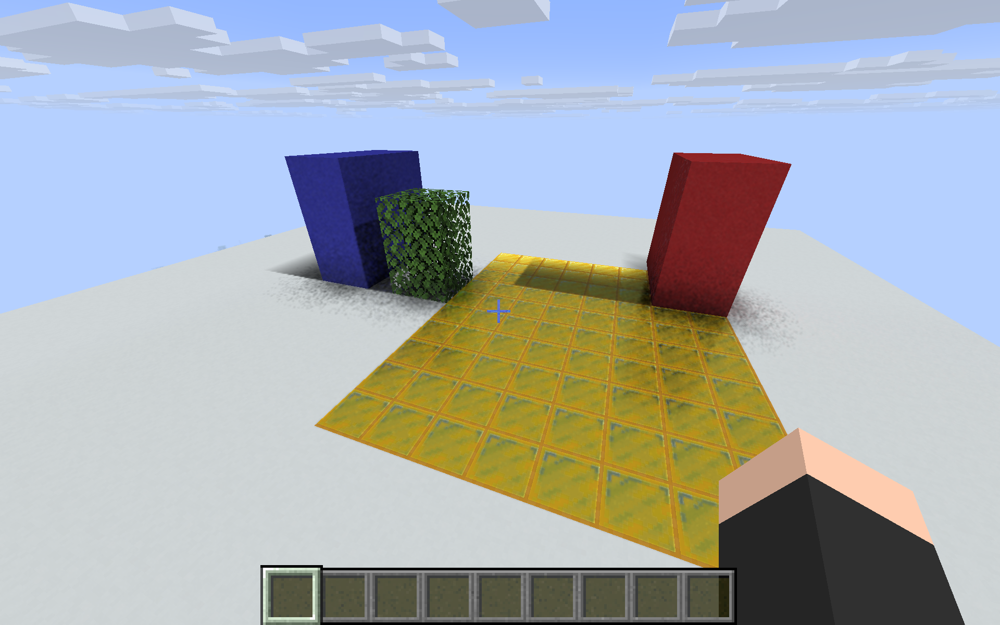

# Temporal reconstruction and diffuse bounce tiers

This stage reduces noise in the displayed hardware lighting, adds static-scene camera motion vectors and stale-history rejection, preserves history across identical scene rebuilds, and adds a separately selectable two-bounce diffuse GI tier. It extends the [material stage](MATERIAL-VALIDATION.md); it does not complete the remaining fluid/entity/scene-scaling work.

## Reconstruction and lifetime

The primary ray pass writes scene-relative position, triangle identity, geometric normal and roughness alongside visibility and radiance. A new compute pass projects each surface into the previous camera image. History is accepted only when the previous sample is in view, its position is within a footprint-aware tolerance, its normal/roughness match, and its triangle identity matches. The pass retains up to 32 frames of AO, sun visibility, reflection and diffuse radiance. Glossy reflection history gets a larger current-frame weight when the viewpoint changes.

Motion vectors store **previous minus current** full-resolution pixel coordinates in Metallum's offscreen orientation. They describe camera motion through the current static scene; dynamic entity motion is not implemented. A validity channel records accepted reprojection. Odd framebuffer sizes are covered by the native test.

Ping-pong history textures avoid reading and writing the same history image in a pass. All passes participate in the renderer's fence chain. Unchanged scene replacements inherit history only after exact equality checks of vertex, material and texel buffers on the same device. Changed scenes get independent history. Tests cover both successful inheritance and rejection after a geometry change.

History resets on invalid scene state, framebuffer changes, skipped encoded frames, large camera translations, significant sun changes, changed lighting controls, and changed bounce/temporal flags. Small camera moves can retain valid surface history through reprojection. Geometry changes still briefly fall back to raster lighting while a complete local snapshot is rebuilt; removing that fallback interval requires incremental scene updates.

This is a custom temporal accumulator and spatial reconstruction pass. It is **not MetalFX** and is not a general production denoiser. Specular disocclusion and animated materials/entities require broader tests and better guides.

## Native correctness evidence

[Temporal results](rt-core/results/temporal-proof.json), [frame/lifetime results](rt-core/results/frame-temporal-proof.json).

| Check | Result |
|---|---|
| 64-frame noisy visibility sequence | AO variance is 0.01968 of unfiltered variance. |
| Noisy reflection sequence | Reflection variance is 0.02009 of unfiltered variance. |
| Accumulation length | Reaches and caps at 32 frames. |
| Exact one-pixel camera shift | Reprojects the expected old sample and outputs a two-full-pixel motion vector. |
| Rejection | Changed primitive, flipped normal, changed depth/position, out-of-view projection and explicit reset each use fresh data. |
| Odd output size | 63×47 physical pixels mapped to 32×24 half-resolution data pass. |
| Zero-strength frame and alpha | Zero baseline errors and zero alpha errors. |
| Scene ownership | Identical geometry inherits history; changed geometry is rejected; statistics remain accessible. |

These tests run the actual Metal kernels with Metal API Validation on the M5 Pro.

## Actual game noise measurements

Two twelve-frame sequences were captured at 200 ms intervals with the same camera, scene, fixed time and lighting settings. Only temporal accumulation changed. Measurements are temporal variance across those saved frames, not a universal denoiser quality score. Sky/cloud regions are excluded. [Raw region measurements](runs/temporal-live-noise.json).

| Region | Variance without history | With history | Reduction |
|---|---:|---:|---:|
| Contact AO | 40.9322 | 0.5310 | 98.70% |
| Gold-floor reflection | 1.9091 | 0.0635 | 96.68% |
| Blue wall | 9.7046 | 0.1752 | 98.19% |
| Hand control | 0 | 0 | Unchanged |

Average colors stayed close. The largest measured mean shift was about 1.25 red channel levels on the gold floor; temporal radiance averaging precedes nonlinear display conversion. These saved sequences are correlated in time, so the ratios should not be interpreted as independent-sample efficiency.

| Temporal disabled | Temporal enabled |
|---|---|
|  |  |

## Movement and edits

The guarded `RtMotionCapture` helper executes commands only in the development copy and captures frames at approximately 20, 50, 100, 200, 350, 600, 1000 and 1600 ms after command submission. Per-frame player coordinates and native statistics are saved under `runs/motion-*`.

- A one-block camera move retained history: `historyResets=1` before and after the sequence, while encoded frame count increased. [50 ms capture](screenshots/motion-move-01.png), [50 ms state](runs/motion-move-01.txt), [1600 ms state](runs/motion-move-07.txt). No obvious persistent trails were visible in the inspected captures; this is a limited motion test, not full gameplay acceptance.
- Removing the blue pillar invalidated the old scene immediately. At 100 ms, its old shadow and AO are absent, but other RT contributions also fall back temporarily. [Capture](screenshots/motion-remove-02.png), [state](runs/motion-remove-02.txt). A new RT scene was active by the 1600 ms capture. [State](runs/motion-remove-07.txt).
- A larger move/rotation rebuilt the local scene and restarted history. [Early state](runs/motion-teleport-00.txt), [later state](runs/motion-teleport-07.txt). The restore capture sequence overlaps that move and is not used as an independent visual comparison.

## More than one diffuse bounce

`metallum.rt.bounces` selects one to four diffuse segments, defaulting to one. Two bounces are the tested additional quality tier. Every segment uses an actual hardware hit, the hit material's albedo/emission and sun visibility; throughput is multiplied by diffuse albedo at each bounce. Misses contribute no extra ambient sky light over the baked baseline. The three/four-bounce settings are bounded implementation options and have not received separate quality/performance acceptance. In the live sunlit red-wall fixture, switching from one to two bounces increased mean floor red by 1.70 channel levels, versus about 0.11 green/blue; the gain is modest in this daylight scene. [One bounce](screenshots/capture-gi-one-temporal.png), [two bounces](screenshots/capture-gi-two-temporal.png), [measurement](runs/two-bounce-live-comparison.json).

In the controlled colored-wall test, one bounce produced blue radiance 0.30038; two produced 0.39688 while red remained zero. The test requires a nontrivial additional contribution and reruns reflection, texture, roughness and material-update checks. [Results](rt-core/results/multi-bounce-proof.json).

## GPU timing and MetalFX capability

The native library now samples completion timestamps for the **renderer command buffer containing the RT passes**. This includes other renderer work in that command buffer, and is not an isolated RT-kernel cost or physical presentation interval. The completion handler retains an independent metrics object. The Java bridge loads its native library once in a JVM-lifetime arena: callbacks can outlive individual scenes, so scene closure must not unload their executable code. Per-scene arenas and native resources still close independently.

An initial live observation reported 2,728 completed frames, only one history reset across repeated identical scene publications, and mean command-buffer GPU duration of 6.75 ms. [Initial observation](runs/statistics-initial-1789384946390.txt). Later quality comparisons must use interval deltas rather than mixing all prior frames.

The installed SDK and an executed capability query confirm that this M5 Pro supports the MetalFX temporal denoised scaler through both ordinary Metal and Metal 4, with reported scale factors 1–3. **The capability test does not execute the denoiser.** [Result](rt-core/results/metalfx-capabilities.json), [probe source](rt-core/MetalFXCapabilities.mm). The actual integration still needs diffuse/specular albedo, roughness, depth, correctly specified motion, optional hit-distance guides, reset handling and output quality validation. Native headers were inspected at the installed Xcode SDK's `MetalFX.framework/Headers/MTLFXTemporalDenoisedScaler.h`.

## Controls and remaining gates

`metallum.rt.temporal=false` disables accumulation for comparisons while retaining the resolve pass. `metallum.rt.bounces=1` is the default; `2` enables the additional tested diffuse segment. The development helpers `rt-temporal-diagnostics.jar PID temporal-on|temporal-off|bounces-one|bounces-two|statistics-LABEL|series-LABEL` are restricted to the copied game directory.

Outstanding work includes MetalFX execution, better specular/history handling, dynamic entity motion, animated textures, water/glass/wet surfaces, large resident scenes and incremental updates, local area lights, physically separated base lighting, persistent user-facing settings, a source voxel fallback, the complete scene/mod test suite and final sustained performance acceptance.

## Reproduce and rollback

Build with the Java 25 and cached Gradle instructions in `README.md`. Native tests are `build/frame-proof`, `build/temporal-proof` and `build/transport-proof`, run from `rt-core` with `MTL_DEBUG_LAYER=1`. The separate capability probe is built by `sh rt-core/build-capabilities.sh` and run as `rt-core/build/metalfx-capabilities`.

The installed renderer hash is recorded in `instance-manifest.json`. `tools/install_development_renderer.py` retains prior JARs by hash under `runs/renderer-backups` and refuses to write while the development instance is running. The stable material-stage rollback JAR has SHA-256 `ce7a4bc7842564242de285f689ec86096db1ed15ae5fb8cf5466ab4979ff4b5b`. Close the development game before restoring that JAR to its `minecraft/mods/metallum-0.0.24-rt-dev.1.jar`. The original and tuned Prisma instances are separate.

## Short quality-tier performance comparison

Three ten-second client profiles were recorded per tier at actual 1920×1200, the 60 cap, all current effects enabled and temporal reconstruction on. The sunlit red-wall/white-floor scene and camera were fixed. GPU means use completed-command-buffer count/total-time deltas across the separately logged intervals, including the profiles and intervening idle gameplay.

| Diffuse tier | Renderer-loop FPS | CPU frame-loop p95 | Mean renderer-command GPU duration |
|---|---:|---:|---:|
| One bounce | 59.54–59.69 | 17.16–17.49 ms | 7.25 ms |
| Two bounces | 59.52–59.75 | 17.22–17.60 ms | 7.57 ms |

[Interval calculations and source files](runs/temporal-quality-performance.json), [one-bounce raw profiles](runs/temporal-one-cap60-results.json), [two-bounce raw profiles](runs/temporal-two-cap60-results.json). The second bounce added about 0.32 ms to the measured renderer command buffer in this fixture. The one-bounce default is retained; both tiers remain subject to full-scene/sustained acceptance. These are neither isolated RT-kernel times nor physical display scanout measurements.
